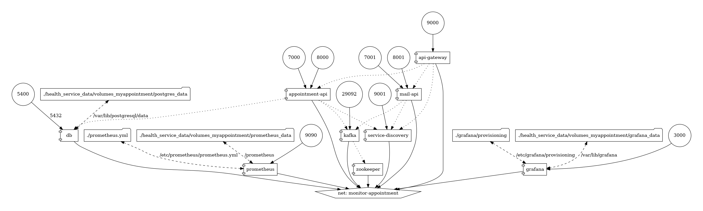
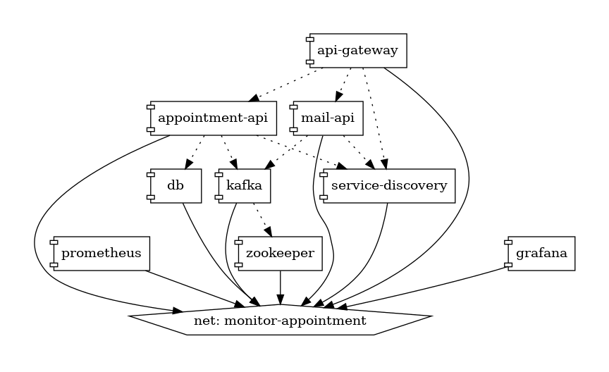
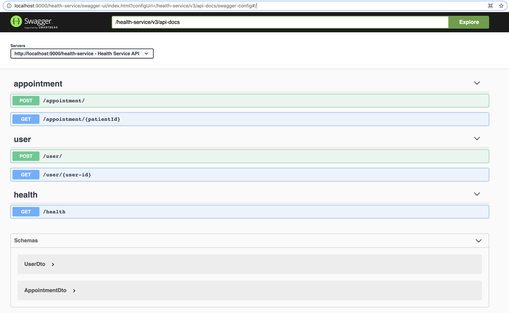
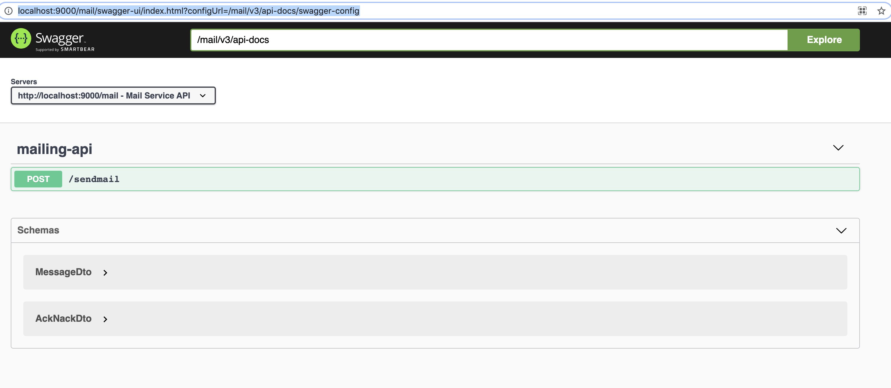

<h1>Health Service</h1>

This is work in progress...

A dumb down version of health service api. The core functionality that will be offered by this API will be: 
appointment service, reminder service, mailing service, prescription api, patient history, admin dashboard, patient dashboard etc.

<h2>Implementation Details</h2>

<h3>Application Services</h3>

<h5>Technology Stack </h5>

<h6>Framework Support</h6>
1. Springboot
2. Spring Data JPA
3. Spring Validation
4. Spring JPA

<h6>Database</h6>
1. Server - Postgres
2. Query Language - JPQL/Native

<h6>API Documentation</h6>
1. OAS (Open API Standard)
<li>Data Models</li>
<li>Path and Operations</li>
<li>Security Scheme</li>
<li>Basic Info</li>

<h6>Server</h6>
<li>Tomcat</li>

<h6>Message Broker</h6>

Kafka with Zookeeper

[Github image URL](https://gist.github.com/rmoff/fb7c39cc189fc6082a5fbd390ec92b3d)
 
Manually creating topic and testing via consumer and producer

1. Connecting to container
   <code>docker exec -it <container-id> /bin/bash</code>
2. Creating new queue
   <code>kafka-topics --create --topic appointment-mail-topic --partitions 2 --replication-factor 1 --zookeeper zookeeper:2181</code>
3. Producer
   <code>kafka-console-producer --broker-list localhost:29092 --topic appointment-mail-topic</code>
4. consumer
   <code>kafka-console-consumer --bootstrap-server localhost:29092 --topic appointment-mail-topic --from-beginning</code>
   
<h6>SSL Certificate</h6>

New keystore can be generated using below command:

<code>keytool -genkeypair -alias healthservice -keyalg RSA -keysize 4096 -storetype PKCS12 -keystore healthservice.p12 -validity 3650 -storepass password</code>

<h5>Design</h5>

To generate docker compose diagram:

<h6>Architecture Diagram</h6>
<code>docker run --rm -it --name dcv -v $(pwd):/input pmsipilot/docker-compose-viz render -m image docker-compose.yml -o images/arch/arch-diag.png --force</code>

<h6>Architecture Diagram - No Ports,Volumes</h6>
<code>docker run --rm -it --name dcv -v $(pwd):/input pmsipilot/docker-compose-viz render -m image docker-compose.yml --no-volumes --no-ports -o images/arch/arch-diag-no-vol-no-ports.png --force</code>

<h5>Application</h5>

<h6>Appointment API</h6>
<label>Name: </label>
<b>MyAppointment</b>

[Swagger URL](https://localhost:9000/appointment/swagger-ui/index.html?configUrl=/appointment/v3/api-docs/swagger-config#/)

<h6>Screenshot</h6>

<h6>Mail API</h6>
<label>Name: </label>
<b>Mail API</b>

[Swagger URL](https://localhost:9000/mail/swagger-ui/index.html?configUrl=/mail/v3/api-docs/swagger-config)

<h6>Screenshot</h6>

