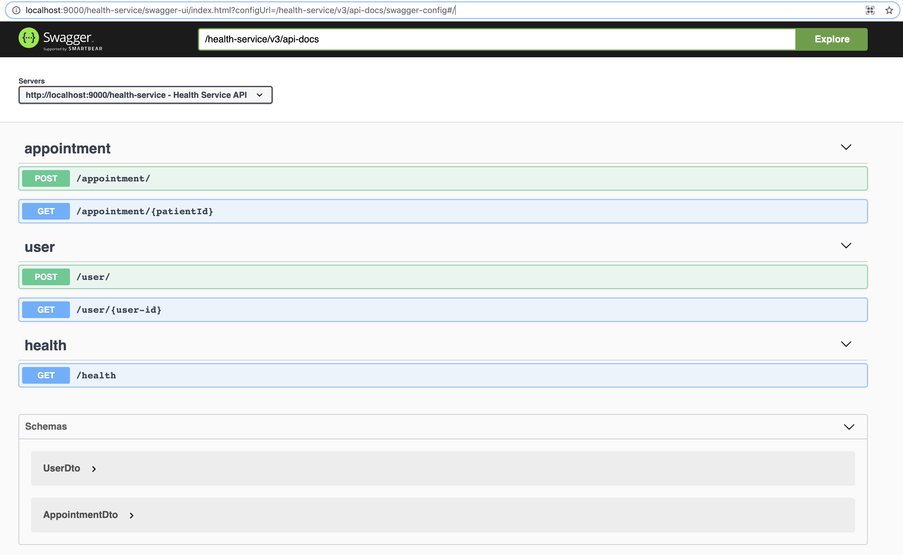
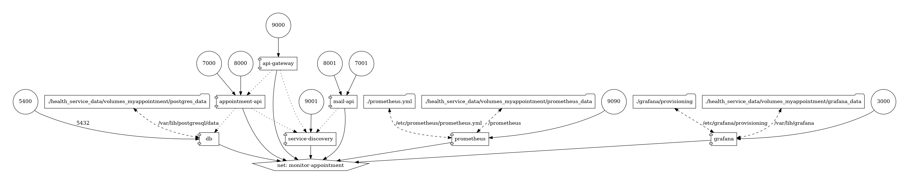
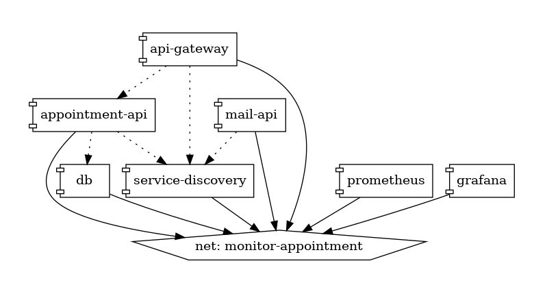

<h1>Health Service</h1>

A dumb down version of health service api. The core functionality it offers are appointment service, reminder service, 
mailing service, prescription api, patient history, admin dashboard, patient dashboard etc.

<h2>Implementation Details</h2>

<h3>Application Services</h3>

<h4>Appointment API</h4>
<label>Name</label>
<b>MyAppointment</b>

<h5>Technology Stack </h5>

<h6>Framework Support</h6>
1. Springboot
2. Spring Data JPA
3. Spring Validation
4. Spring JPA

<h6>Database</h6>
1. Server - Postgres
2. Query Language - JPQL/Native

<h6>API Documentation</h6>
1. OAS (Open API Standard)
<li>Data Models</li>
<li>Path and Operations</li>
<li>Security Scheme</li>
<li>Basic Info</li>

<h6>Server</h6>
<li>Tomcat</li>

<h5>Application</h5>

[Swagger URL](http://localhost:9000/health-service/swagger-ui/index.html?configUrl=/health-service/v3/api-docs/swagger-config#/)

<h6>Screenshot</h6>

<h5>Design</h5>

To generate docker compose diagram:

<h6>Architecture Diagram</h6>
<code>docker run --rm -it --name dcv -v $(pwd):/input pmsipilot/docker-compose-viz render -m image docker-compose.yml -o images/arch-diag.png --force</code>

<h6>Architecture Diagram - No Ports,Volumes</h6>
<code>docker run --rm -it --name dcv -v $(pwd):/input pmsipilot/docker-compose-viz render -m image docker-compose.yml --no-volumes --no-ports -o images/arch-diag-no-vol-no-ports.png --force</code>

